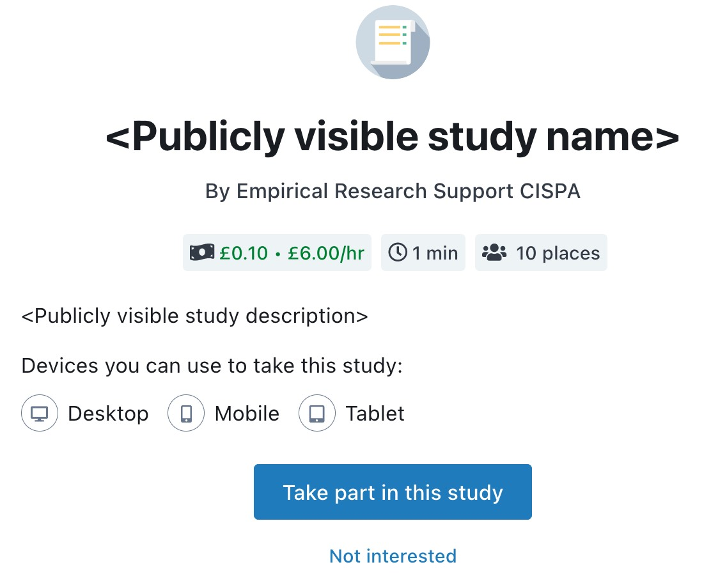

```{r, include = FALSE}
stopifnot(require(knitr))
options(width = 90)
knitr::opts_chunk$set(
  eval = FALSE,
  collapse = TRUE,
  comment = "#>",
  dev = "jpeg",
  dpi = 100,
  fig.asp = 0.8,
  fig.width = 5,
  out.width = "60%",
  fig.align = "center"
)
library(prolific.api)
library(lenau)
```

The **prolific.api** package provides functionalities for creating and managing empirical crowd-sourcing studies on the 
[prolific.co](https://www.prolific.co/) platform by using the platform's API access.

## Introduction


***Note:***
An
[API token](https://docs.prolific.co/docs/api-docs/public/#section/Authentication) 
is required for accessing the API of 
[prolific.co](https://www.prolific.co/). 
For more details, see the section on *[obtaining an API token](#get-token)*.


## Core Functionalities

The main functionalities in the **prolific.api** package are provided in three
`ReferenceClasses`:

| Class                  | Functionality                                         |
| :--------------------- | :---------------------------------------------------- |
| `api_access`           | - Access the API<br>- Submit and retrieve information |
| `prolific_study`       | - Set up and modify studies                           |
| `prolific_prescreener` | - Define the group of eligible participants           |

*In general, all fields and methods of these classes are available in a `RefClass` as well as `S4` object style (see examples).*
The core functionalities are summarized below.

### Submitting and retrieving information: The `api_access` class

The `api_access` class is designed for interacting with 
[Prolific's API](https://docs.prolific.co/docs/api-docs/public/).
The central method to achieve this is `access`, which can be used
to exchange (retrieve and submit) information with the API.

#### Setting up `api_access`

An `api_access` object can be created by 

```{r include = FALSE,eval=TRUE}
prolific_api_access <- api_access(api_token = readLines("~/.prolific_api/R_package_prolific.api_token", warn = FALSE))
```

```{r eval = FALSE}
prolific_api_access <- api_access(api_token = "<api_token>")
```

The `api_token` is the only information that **needs to be specified** for the API acces to work. 
All other settings when creating an `api_access` rarely require adjustment.

To check whether the token is valid,  use the `check_authorization` method:
```{r eval = TRUE}
check_authorization(prolific_api_access)
```


The section on 
*[obtaining an API token](#get-token)* 
describes how to obtain a valid token.

#### Using `api_access` 

The actual API access is mostly carried out using the `access` method of the `api_access` class.
`access` provides different methods for exchanging information with the API, depending on the purpose:

| Method     | Function                                   |
| :--------- | :----------------------------------------- |
| `get`    | Retrieving endpoint / data                 |
| `post`   | Create endpoint / send data                |
| `patch`  | Change endpoint using a delta (difference) |
| `put`    | Replace endpoint                           |
| `delete` | Delete endpoint                            |

This table lists the available methods, which are specified in the `method` argument of the `access` method.

For retrieving information from [prolific.co](https://www.prolific.co/) using the `get` method,
a simple example is

```{r eval = FALSE}
access(prolific_api_access,
  method = "get",
  endpoint = "users/me"
)
```
which shows some information about the account you are accessing the API with.


A simple example for submitting information to the API using the `post` method is

```{r eval = FALSE}
access(prolific_api_access,
  endpoint = "study-cost-calculator",
  method = "post",
  data = list(
    reward = 100,
    total_available_places = 5
  )
)
```

which calculates the cost  (including fees and taxes)  of a study where `5` participants are paid `1` € each.

More realistic examples are provided in the [examples](#examples) section below, while 
a list of further endpoints is provided in the 
<!-- [vignette on Prolific's API endpoints](prolificapi-endpoint.html)
as well as  -->
[Prolific's API documentation](https://docs.prolific.co/docs/api-docs/public).

### Set-up and change studies: The `prolific_study` class

The `prolific_study` class provides a lightweigt interface for
creating, and managing studies on [prolific.co](https://www.prolific.co/) using `R`.
There are a lot of options to be chosen from when setting up such a study, but let's start with a simple example.

#### Creating a `prolific_study`

A minimal specification for creating a `prolific_study` contains the following information:

```{r eval = TRUE}
new_study <- prolific_study(
  # Information shown to participants
  name = "<Publicly visible study name>",
  description = "<Publicly visible study description>",
  estimated_completion_time = 1,
  reward = 1,
  # URL participants are redirected to
  external_study_url = "https://www.link_to_my_study.com",
  # Completion code to verify participation
  completion_code = "123",
  # Number of participants to recruit
  total_available_places = 10
)
```


The information that is presented to the potential participants 
contains the study's 

- **name**,
- **description**,
- **estimated completion time**,
- **reward** and
- **total available places**.

To them, the study will then look like this:

{width=75%}  

<br/><br/>

People deciding to take part in a study can click on "Open study link in a new window", which redirects them
to the

- **external study url**

where the study is conducted.
Once they completed your study, you should provide them with a

- **completion code** 

and redirect them back to [prolific.co](https://www.prolific.co/).
Participant compensation is then based on the completion code by checking
whether a participant obtained the correct completion code
after completing the study.
^[Participant compensation does not happen automatically, so you still can check which participants are compensated, e.g. in case of erroneous completion codes.]


#### Checking the Validity of a `prolific_study`

The arguments for constructing `new_study` above are the ones that need to be specified for a study to be 
created on [prolific.co](https://www.prolific.co/). To make sure that all necessary fields of a `prolific_study`
have been set, the `validity_check` method can be used.
In case a study has all required information, it simply returns `TRUE`:

``` {r eval = TRUE}
validity_check(new_study)
```

In cases where a study lacks some of the information, it returns a message that guides through the required steps:

``` {r eval = TRUE}
new_study_without_information <- prolific_study()
validity_check(new_study_without_information)
```

(note that the `estimated_completion_time`, `reward` and `total_available_places` 
are not mentioned in this message because they have default values of `1`).


#### Updating Fields in a `prolific_study`  {#studies_fields_update}

All classes provided by the `prolific.api` allow field access in `S4` and `RefClass` style.
Therefore, the information contained in a `prolific_study` can be changed using either syntax.
For example, you can change the name of `new_study` using either one:

``` {r eval = TRUE}
# First way to set a new name (S4 style)
name(new_study) <- "<A more informative study name>"
# Second way to set a new name (RefClass style)
new_study$name <- "<A more informative study name>"
```

Both lines of code have the same effect, and the `name` field of `new_study` is now `"<A more informative study name>"`:

``` {r eval = TRUE}
print(new_study)
```

Equivalent access works for all other fields in `prolific_study` objects, 
which are listed in `help(prolific_study)`.

##### Posting, Patching and Deleting a `prolific_study` on the platform
<!-- ##### Posting a `prolific_study` on the platform -->

After creating or changing a `prolific_study` in `R`,
the study can be submitted to  [prolific.co](https://www.prolific.co/) 
to represent it on the platform.

To submit the newly created `new_study` to the Prolific platform,
we use 


``` {r eval = TRUE}
prolific_api_access$access(
  endpoint = "studies",
  method = "post",
  data = new_study
)
```

The output shows that the study has been assigned an `id`, which is 
`"`r new_study$id`"` in this case.
This `id` is determined by [prolific.co](https://www.prolific.co/), 
and the unique identifier for the study on the platform.
You can now also find the study in the webinterface.

<!-- ##### Patching a `prolific_study` on the platform -->

To change the study specifications, you can adjust the fields as described in 
["Updating Fields in a `prolific_study`"](#studies_fields_update),
and then use `prolific_api_access$access` with `method = "patch"` or `method = "put"`
for the studie's endpoint, which is 
`"`r paste0("studies/",new_study$id)`"` in this case:

```{r, include=FALSE, cache=FALSE,eval=TRUE}
writeLines(
  c(
    "## ---- get-study",
    "# Decrease the study's total available places",
    "total_available_places(new_study) <- 5L",
    "# Increase the study's reward",
    "reward(new_study) <- 2L",
    "# Change the study's name",
    "name(new_study) <- \"How to change studies on Prolific\"",
    "# Change the study's name",
    "prolific_api_access$access(",
    "",
    "# Patch the study on prolific.co",
    paste0("\tendpoint = c(\"studies\",new_study$id", "),"),
    "\tmethod = \"patch\",",
    "\tdata = new_study",
    ")"
  ),
  con = "tmpfile.R"
)
```


```{r, include=FALSE, cache=FALSE,eval=TRUE}
knitr::read_chunk("tmpfile.R")
```

```{r, get-study, eval=TRUE,include=TRUE}
```


<!-- ##### Deleting a `prolific_study` on the platform -->

Ultimately, a study can be deleted using `access` with `method = "delete"` on the study's endpoint:

``` {r eval = TRUE, include = TRUE,results = FALSE}
prolific_api_access$access(
  endpoint = c("studies", new_study$id),
  method = "delete"
)
```

### Defining eligible participants: The `prolific_prescreener` class 

A list of all currently available prescreeners is provided in the
[Prolific prescreeners vignette](prolificapi-prescreeners.html)


## Detailed Examples {#examples}

```{r setup}
library(prolific.api)
```


## Obtaining an API token {#get-token}

The **prolific.api** package requires 
an 
[API token](https://docs.prolific.co/docs/api-docs/public/#section/Authentication) 
for accessing the API of 
[prolific.co](https://www.prolific.co/).


To get such a token, you first need a researcher account on 
[prolific.co](https://www.prolific.co/).
When logging in to this account, you can obtain the *workspace-specific* token
by selecting the workspace you would like to work in, for which 
the tokens can be managed in the `Settings -> Go to API token page` menu.


